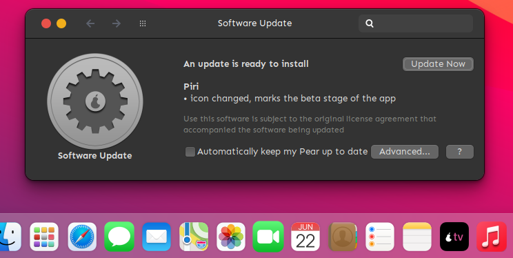
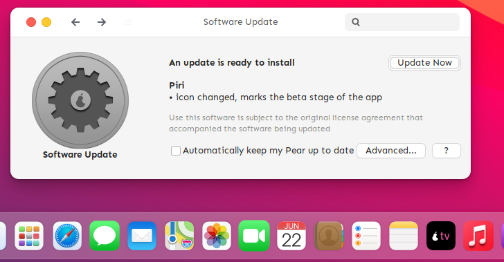

# PEXT Installer

## Introduction
PEXT stands for **p**ear **ext**ension file. It is nothing more than a fancy shell script. 
A PEXT file is used by the [update manager](https://github.com/alxb421/update-mgr) to update a pearOS PC.

## Languages:
Python was used for the backend( thanks to [axtlos](https://github.com/axtloss)
Glade was used for the frontend(nice UI :)  )

## Screenshots

Dark mode PEXT Installer

Light mode PEXT Installer

The Screenshots are showing an update to the [Piri voice assistant](https://github.com/alxb421/piri-backend)

## Note
The `Advanceed`, `?` and ` [] Automatically keep my Pear up to date` buttons are just visual. I need to add settings in a future update
